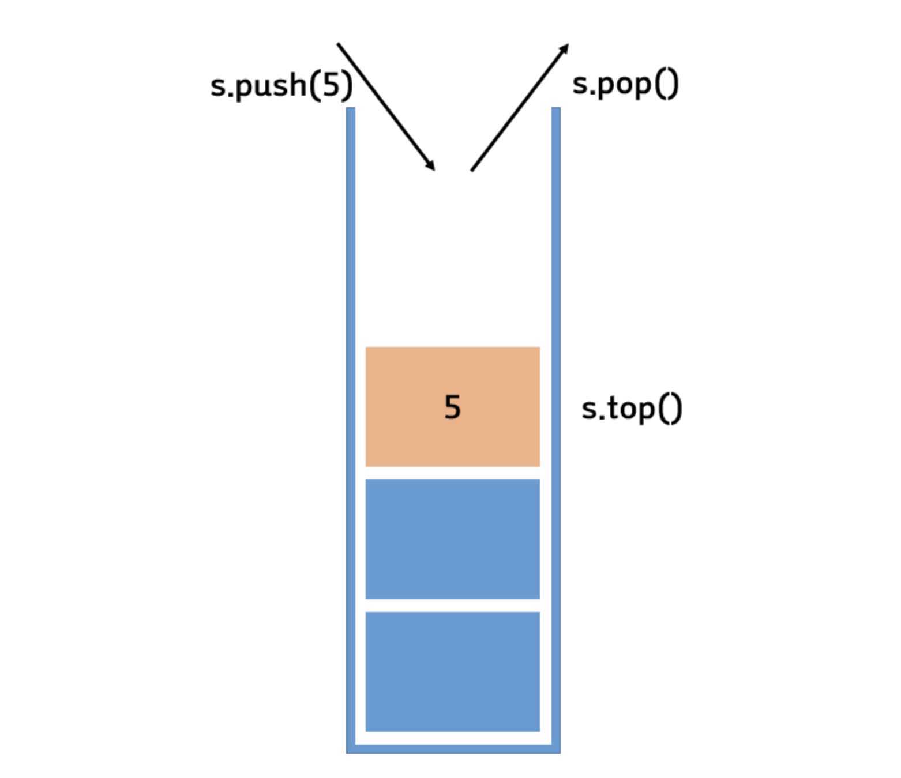
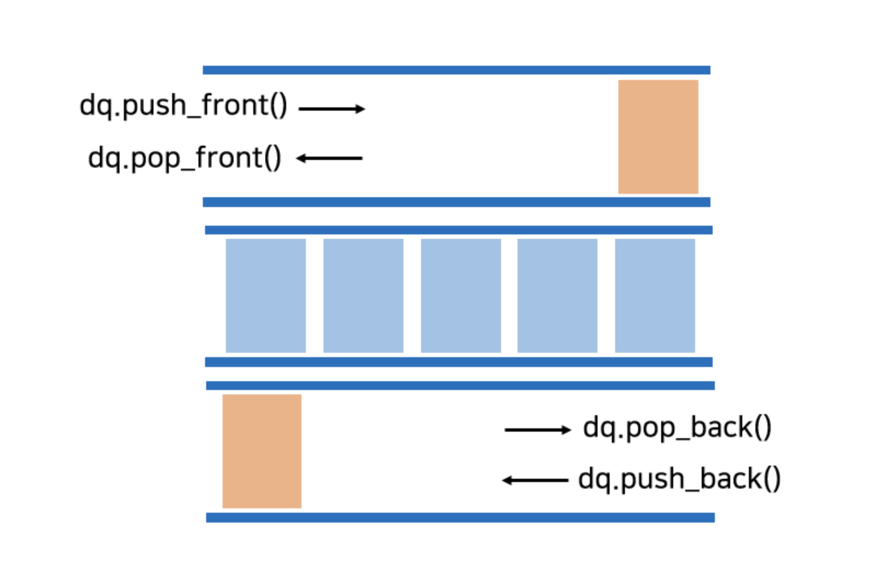

## Stack(스택)



```
스택은 한 쪽 끝에서만 자료를 넣고 빼는 작업이 이루어지는 자료구조이다. LIFO (Last In First Out) 방식으로 동작하며 가장 최근에 스택에 삽입된 자료의 위치를 top 이라 한다.

스택의 stack.push 는 top 에 새로운 데이터를 추가하고, stack.pop 은 가장 최근에 삽입된 데이터가 스택에서 삭제된다.

스택의 맨 위 요소, top 에만 접근이 가능하기 때문에 top 이 아닌 위치의 데이터에 대한 접근, 삽입, 삭제는 모두 불가능하다.

스택이 비어있을 때 stack.pop을 시도하는 것을 stack underflow 라 하고 스택의 크기가 비어있을 때 stack.push 를 시도할 때 stack overflow 가 발생한다.
```

- ### 시간 복잡도
  ```
  top 위치의 데이터에 바로 접근이 가능하기 때문에 데이터 삽입, 삭제의 시간 복잡도는 O(1) 이다.
  ```
- ### 장단점
  - top 을 통해 접근하기 때문에 데이터 접근, 삽입, 삭제가 빠르다
  - top 위치 이외의 데이터에 접근할 수 없기 때문에 탐색이 불가능하다. 탐색하려면 모든 데이터를 꺼내면서 진행해야 한다.
  - 스택은 웹 브라우저의 뒤로 가기 기능, 실행 취소(undo) 기능, 함수 호출 등에서 사용되며, 데이터를 역순으로 접근해야 하는 경우에 유용합니다.
- ### 활용
  - 스택은 컴퓨터 메모리 관리, 문자열 역순 출력, 깊이 우선 탐색(DFS) 알고리즘 등에 사용됩니다.

## Queue(큐)


```
한쪽에서만 데이터의 삽입 삭제가 이루어졌던 스택과 달리
큐는 양쪽 끝에서 데이터의 삽입과 삭제가 각각 이루어진다.
FIFO (First In First Out) 으로 동작하며 데이터가 삽입되는 곳을 rear,
데이터가 제거되는 곳을 front 라 한다.
데이터를 삭제하기 전에는 큐가 empty 한지, 큐에 데이터를 추가하려 할 때는 큐가 full 인지 확인 후 진행해야 한다.
```

- ### 선형 큐
  
- 선형 배열을 사용하여 구현된 큐
- 삽입을 위해서는 계속해서 요소들을 이동시켜야 함
- front, rear 는 증가만 하는 방식, 실제로는 front 앞쪽에 공간이 있더라도 삽입할 수 없는 경우가 발생할 수 있음

- ### 원형 큐
  
- 선형 큐의 단점을 보완
- front = 맨 첫번째 요소 바로 앞을 가리킴
- rear = 마지막 요소 가리킴
- 큐 empty 상태 : front == rear
- 큐 full 상태 : front == (rear+1) % MAX_QUEUE_SIZE
- 공백 상태와 포화 상태를 구분하기 위해 하나의공간을 비워둠

- ### 시간복잡도
  - 큐 역시 front, rear 의 위치로 데이터 삽입 삭제가 바로 이루어지기 때문에 원소 삽입, 삭제의 시간 복잡도는 O(1) 이다.
- ### 장단점
  - 데이터 접근, 삽입, 삭제가 빠르다.
  - 큐 역시 스택과 마찬가지로 중간에 위치한 데이터에 대한 접근이 불가능하다.
  - 큐는 메시지 큐, 이벤트 처리, 프로세스 스케줄링(운영체제) 등에서 사용되며, 데이터를 순차적으로 처리해야 하는 경우에 사용됩니다.
- ### 활용
  - 큐는 너비 우선 탐색(BFS) 알고리즘, CPU 스케줄링, 데이터 동기화 등에 사용됩니다.
- ## Deque(덱)



```
Deque 는 Double - Ended Queue 의 줄임말이다
한쪽에서만 삽입, 다른 한쪽에서만 삭제가 가능했던 큐와 달리
양쪽 front, rear 에서 삽입 삭제가 모두 가능한 큐를 의미하는 자료구조이다.

연속적인 메모리를 기반으로 하는 시퀀스 컨테이너 이고 선언 이후
크기를 줄이거나 늘릴 수 있는 가변적 크기를 갖는다.

또한 중간에 데이터가 삽입될 때 다른 요소들을 앞, 뒤로 밀 수 있다. vector 보다는 좋은 성능을 가지지만
앞, 뒤에서의 삽입 삭제 성능에 비해 중간에 삽입 삭제 하는 것은 성능이 좋지 않다
```

- ### 시간 복잡도

  - 삽입 삭제 연산은 마찬가지로 O(1) 의 시간 복잡도를 가지고, 스택/큐와 달리 index 를 통해 요소들에 탐색이 가능하므로 이 역시 O(1) 의 시간 복잡도를 가진다.

- ### 장단점
  - 데이터의 삽입 삭제가 빠르고 앞, 뒤에서 삽입 삭제가 모두 가능하다
  - 가변적 크기
  - index 를 통해 임의의 원소에 바로 접근이 가능하고
  - 새로운 원소 삽입 시, 메모리를 재할당하고 복사하지 않고 새로운 단위의 메모리 블록을 할당하여 삽입한다.
  - 중간에서의 삽입 삭제가 어렵고
  - 스택, 큐에 비해 비교적 구현이 어렵다.
