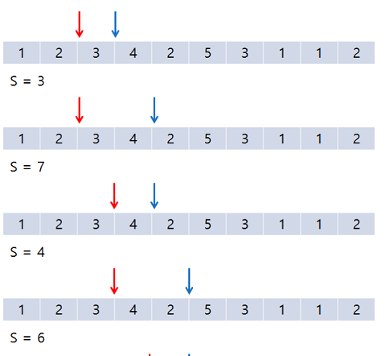
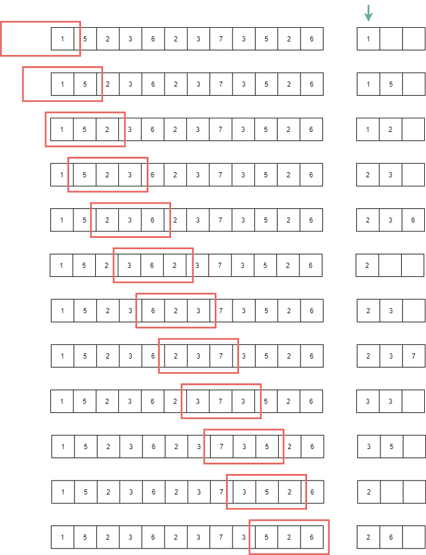
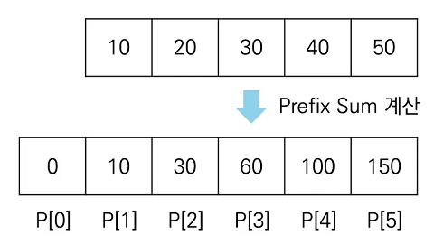

## two pointers 투 포인터
* 원래 이중 for문으로 O(N^2)으로 처리되는 작업을
* 두 개의 포인터를 사용하여 O(N)으로 처리하는 알고리즘
* (시작점, 끝점) 두 개의 포인터로 접근할 데이터의 범위를 표현하면서 구현

## 예제
* 특정한 합을 가지는 부분 연속 수열
* https://www.acmicpc.net/problem/1806

1. 시작점 start, 끝점 end 모두를 idx=0 에 두고 탐색 시작
2. start 에서 end 까지의 부분 수열로 판단
3. 현재 부분 합이 M과 같다면 최소 판단
4. 현재 부분 합이 M보다 작다면, end++
5. 현재 부분 합이 M보다 크거나 같다면, start++

## sliding window 슬라이딩 윈도우
* 주어진 배열에서 고정된 크기의 구간만큼을 탐색하여 O(N)으로 처리하는 알고리즘
* 반복적으로 계산하지 말고, 겹치는 구간 기준 앞 뒤를 계산하는 아이디어
* 쉽게 생각하면 구간의 크기가 고정된 투포인터(?)

## prefix sum 누적 합
* 특정 구간의 합을 계산
* prefix sum : 배열의 맨 앞부터 특정 위치까지의 누적합을 미리 준비
* 누적합 미리 구해두고 prefix_sum[end] - prefix_sum[start] 로 상수시간에 해결

